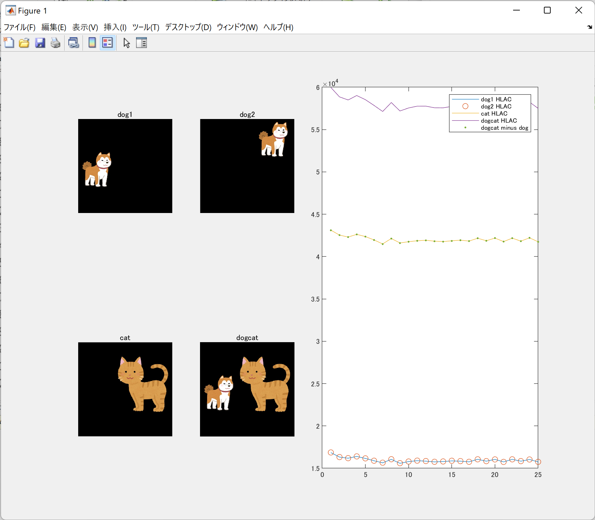
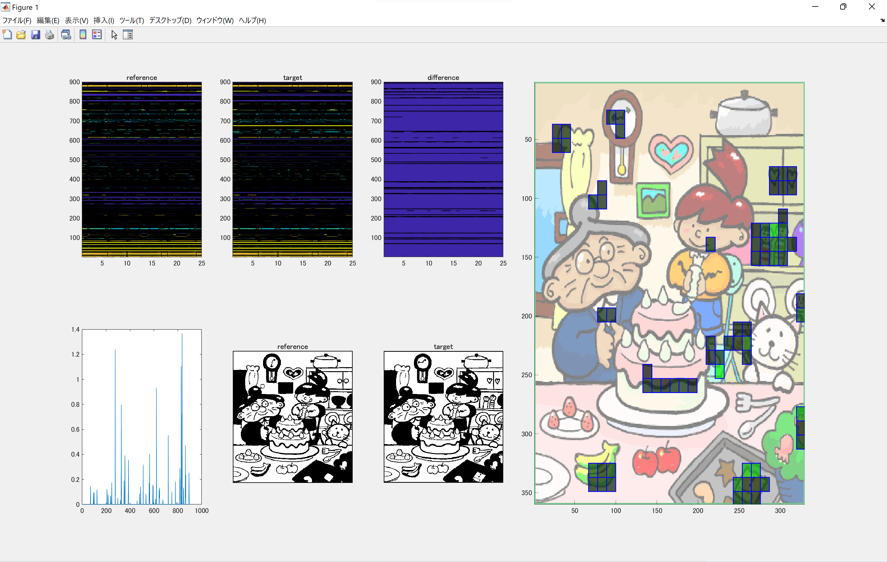

# hlac_mat
HLAC(高次局所自己相関)の位置不変性と加法性の確認

深層学習が嫌いになって禿げそうになるので，精神安定剤としての高次局所自己相関プレイグラウンド
## 元ネタ

[世界一やさしいHLAC入門！(間違い探し編)](https://zenn.dev/kotaro_inoue/articles/f0cbbca962313b)
とても分かりやすく書かれています．
こちらをほぼそのままMATLAB向けに書きなおしました．

## 使い方

1. 2値HLACの実装

    [hlac_main.m](./hlac_main.m)をMATLAB/MATLAB onlineで実行する．

    下記Figureが出現する．
    
    グラフは，犬画像(dog1)，位置が異なる犬画像(dog2)，猫画像(cat)，マージ画像(dogcat)それぞれのHLAC特徴をグラフ化したものである．
    下記確認ができる
    - 位置による特徴量不変(dog1 HLACとdog2 HLACの等価性)の確認
    - 特徴量の加法性(dogcat minus dogとcat HLACの等価性)の確認
        - [マージ画像(猫と犬)の特徴量から犬の特徴量を引き算](./hlac_main.m#L51)したものが猫画像の特徴量とほぼ一致していることが確認できる

2. 2値HLACによる間違い探しの実装
    
    間違い探しの画像は[Wikipedia](https://en.wikipedia.org/wiki/Spot_the_difference)からの引用である．
    [hlac_main2.m](./hlac_main2.m)をMATLAB/MATLAB onlineで実行する．

    下記グラフが出現する．
    
    
    上記グラフは間違い探し画像のReferenceおよびTargetのHLAC特徴量と差分，また，その内積を求めた際の位相差である．位相差が大きい(=間違い探しの答えである確率が大きい)所を，右図に示した．
    

    