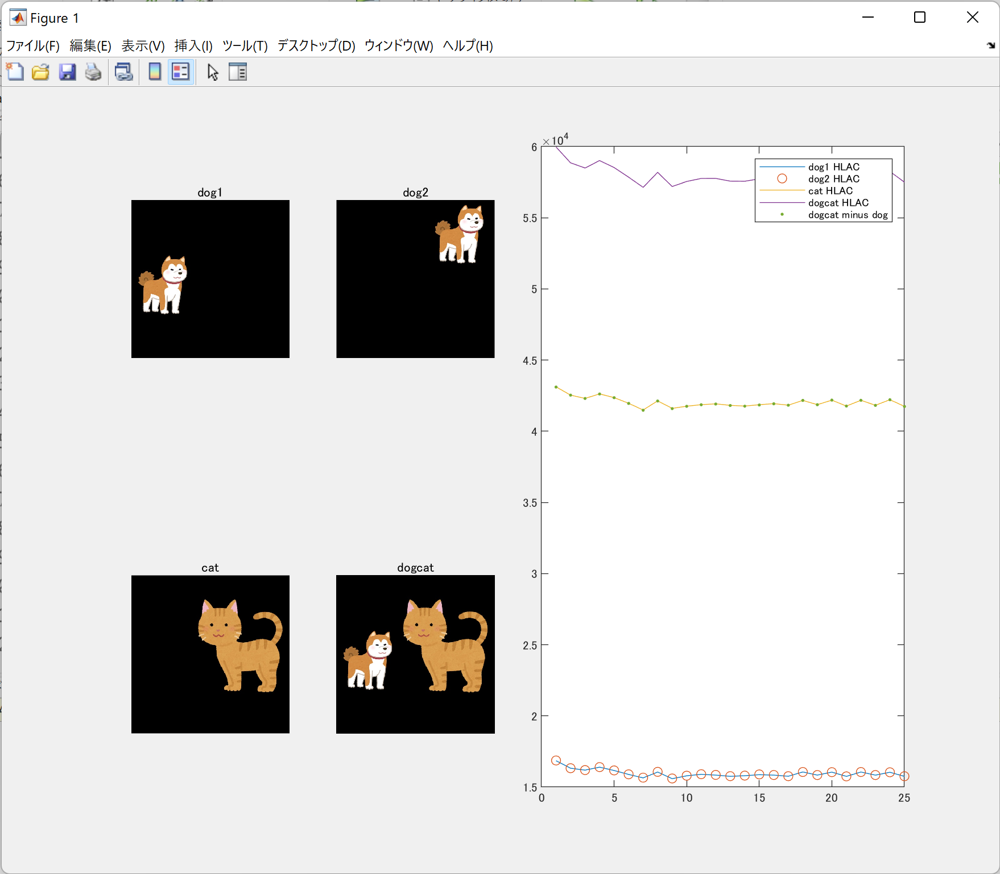

# hlac_mat
HLAC(高次局所自己相関)の位置不変性と加法性の確認

やればやるほど深層学習が嫌いになるので、精神安定剤としての高次局所自己相関プレイグラウンド

## 使い方
[hlac_main](./hlac_main.m)をMATLAB/MATLAB onlineで実行する
下記Figureが出現する。

グラフは、犬画像(dog1)、位置が異なる犬画像(dog2)、猫画像(cat)、マージ画像(dogcat)それぞれのHLAC特徴をグラフ化したものである。
下記確認ができる
- 位置による特徴量不変(dog1,dog2 HLAC)の確認
- 特徴量の加法性(dogcat minus dogとcat HLACの等価性)の確認
    - [マージ画像(猫と犬)の特徴量から犬の特徴量を引き算](./hlac_main.m#L50)したものが猫画像の特徴量とほぼ一致していることが確認できる

